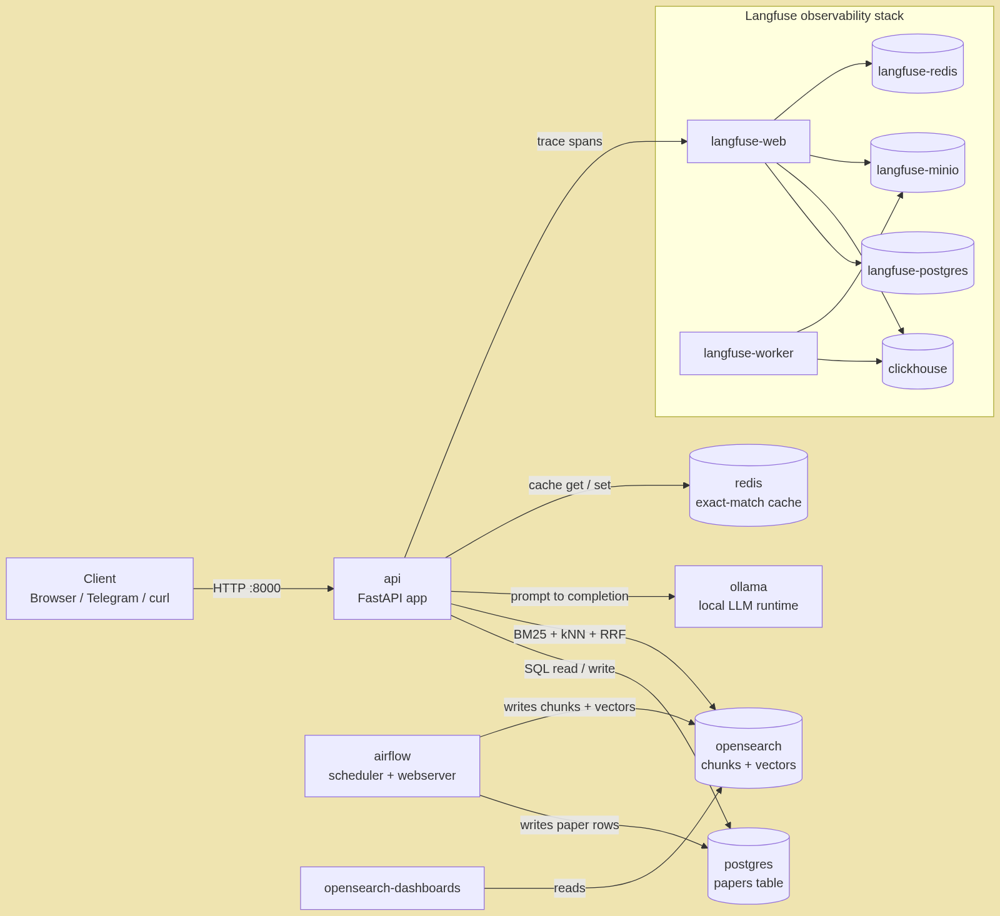

# 🧠 Production-Grade Infrastructure Stack

**An agentic RAG system for curating, indexing, and querying arXiv research papers — built like it ships to production, not a notebook demo.**

Fetches `cs.AI` papers from arXiv, parses and chunks them, indexes them for hybrid BM25 + vector search, and answers natural-language questions about them through a LangGraph agentic pipeline — with caching, tracing, and multi-channel access (REST, Gradio, Telegram) baked in.

---

## ⚙️ Tech Stack

| Layer | Technology |
|---|---|
| **API framework** | FastAPI · Uvicorn · Pydantic v2 / pydantic-settings |
| **LLM orchestration** | LangGraph · LangChain (core / community / ollama) |
| **Local LLM inference** | Ollama (`llama3.2:1b`, `gpt-oss:20b`) |
| **Embeddings** | Jina AI Embeddings v3 (1024-dim) |
| **Search** | OpenSearch (hybrid BM25 + k-NN vector, RRF pipeline) + OpenSearch Dashboards |
| **Relational storage** | PostgreSQL 16 · SQLAlchemy 2.0 · Alembic migrations |
| **Caching** | Redis 7 (exact-match query cache, TTL-based) |
| **PDF parsing** | Docling (table structure, OCR-capable) |
| **Observability / tracing** | Langfuse v3 (self-hosted: ClickHouse + MinIO + Postgres + Redis) |
| **Orchestration** | Apache Airflow (ingestion & processing DAGs) |
| **Chat surfaces** | Gradio UI · Telegram Bot (`python-telegram-bot`) |
| **Containerization** | Docker · Docker Compose |
| **Tooling** | `uv` (dependency mgmt) · `ruff` (lint/format) · `mypy` (typing) · `pytest` (+ `testcontainers`, `polyfactory`) · `pre-commit` |

---

## 🏗️ Architecture




---

## 📁 Project Layout

### Root

| Path | Purpose |
|---|---|
| [`compose.yml`](compose.yml) | Full stack definition — API, Postgres, OpenSearch(+Dashboards), Redis, Ollama, Airflow, and a self-hosted Langfuse stack (ClickHouse, MinIO, its own Postgres/Redis). |
| [`Dockerfile`](Dockerfile) | Builds the FastAPI application container. |
| [`Makefile`](Makefile) | Shortcuts: `make start`, `stop`, `status`, `logs`, `health`, `setup`, `format`, `lint`, `test`, `test-cov`, `clean`. |
| [`pyproject.toml`](pyproject.toml) | Project metadata, dependencies, and tool config (`ruff`, `pytest`, `mypy`). |
| [`uv.lock`](uv.lock) | Locked dependency versions for reproducible installs via `uv`. |
| [`.env` / `.env.example` / `.env.test`](.env.example) | Environment configuration for real, example, and test runs. |
| [`gradio_launcher.py`](gradio_launcher.py) | Standalone entry point for the Gradio chat UI. |
| [`pre-commit-config.yaml`](pre-commit-config.yaml) | Formatting/linting hooks run before each commit. |

### [`src/`](src/) — Application Core

```
src/
├── main.py              # FastAPI app + lifespan service bootstrap + router mounting
├── config.py             # Centralized pydantic-settings config (per-subsystem)
├── database.py            # Singleton DB accessor
├── dependencies.py         # FastAPI DI wiring
├── exceptions.py            # Custom exception hierarchy
├── middlewares.py            # Logging/timing helpers (scaffolded)
├── gradio_app.py               # Gradio chat UI, streams from /stream endpoint
│
├── db/                          # Database abstraction (interface + Postgres impl + factory)
├── models/                       # SQLAlchemy ORM models (Paper table)
├── repositories/                   # Data-access layer (PaperRepository)
├── schemas/                          # Pydantic models: api, arxiv, database, embeddings,
│                                        indexing, pdf_parser, telegram, common
│
├── routers/                            # API endpoints
│   ├── ping.py                            # Health check
│   ├── hybrid_search.py                     # BM25 + vector hybrid search
│   ├── ask.py                                 # Standard RAG Q&A + streaming
│   └── agentic_ask.py                           # LangGraph agentic RAG endpoint
│
└── services/                                     # Business logic (each with its own factory.py)
    ├── agents/          # LangGraph pipeline: graph, state, nodes (guardrail, retrieve,
    │                       grade_documents, rewrite_query, generate_answer, out_of_scope)
    ├── arxiv/            # arXiv API client
    ├── cache/            # Redis exact-match query cache
    ├── embeddings/       # Jina AI embeddings client
    ├── indexing/         # Text chunker + hybrid indexing orchestration
    ├── langfuse/         # Tracing client/wrapper
    ├── ollama/           # Local LLM client + prompt templates
    ├── opensearch/       # Hybrid search client, index mappings, query builder
    ├── pdf_parser/       # Docling-based PDF parsing
    ├── telegram/         # Telegram bot service
    └── metadata_fetcher.py
```

### [`airflow/`](airflow/) — Ingestion Orchestration

Currently a minimal bootstrap (`Dockerfile`, `entrypoint.sh`, `init-db.sql`, a placeholder `hello_world_dag.py`) — the target home for future fetch → parse → embed → index DAGs.

### [`tests/`](tests/)

`api/` for endpoint tests, `unit/` for unit tests — each with its own `conftest.py` fixtures.

### [`notebooks/`](notebooks/) & [`images/`](images/)

Exploratory Jupyter notebooks for prototyping pipeline steps, plus architecture diagrams used in documentation.

---

## 🔌 API Endpoints

| Method | Path | Description |
|---|---|---|
| `GET` | `/api/v1/ping` | Health check |
| `POST` | `/api/v1/hybrid-search` | BM25 + vector hybrid search over paper chunks |
| `POST` | `/api/v1/ask` | Standard RAG question answering |
| `POST` | `/api/v1/stream` | Streaming RAG responses |
| `POST` | `/api/v1/ask-agentic` | Agentic RAG — retrieval decisioning, document grading, query rewriting, cited answers |

---

## 🚀 Getting Started

```bash
# Install dependencies
make setup

# Start the full stack (API, Postgres, OpenSearch, Redis, Ollama, Airflow, Langfuse)
make start

# Check everything is healthy
make health

# Tail logs
make logs
```

| Service | URL |
|---|---|
| API | http://localhost:8000 |
| OpenSearch Dashboards | http://localhost:5601 |
| Airflow | http://localhost:8080 |
| Ollama | http://localhost:11434 |
| Langfuse | http://localhost:3001 |

### Development

```bash
make format     # ruff format
make lint       # ruff check + mypy
make test       # pytest
make test-cov   # pytest with coverage report
```

---

## 🧩 How a Question Gets Answered

1. **Guardrail** — checks the query is in-scope before doing any work.
2. **Retrieve** — hybrid search (BM25 + k-NN) pulls candidate chunks from OpenSearch.
3. **Grade documents** — the LLM judges whether retrieved chunks are actually relevant.
4. **Rewrite query** — if relevance is poor, the query is reformulated and retried.
5. **Generate answer** — Ollama produces a cited answer from the relevant chunks.
6. **Out of scope** — a graceful fallback path when nothing relevant exists.

Every step is traced through Langfuse, and repeated queries are served instantly from the Redis cache.
